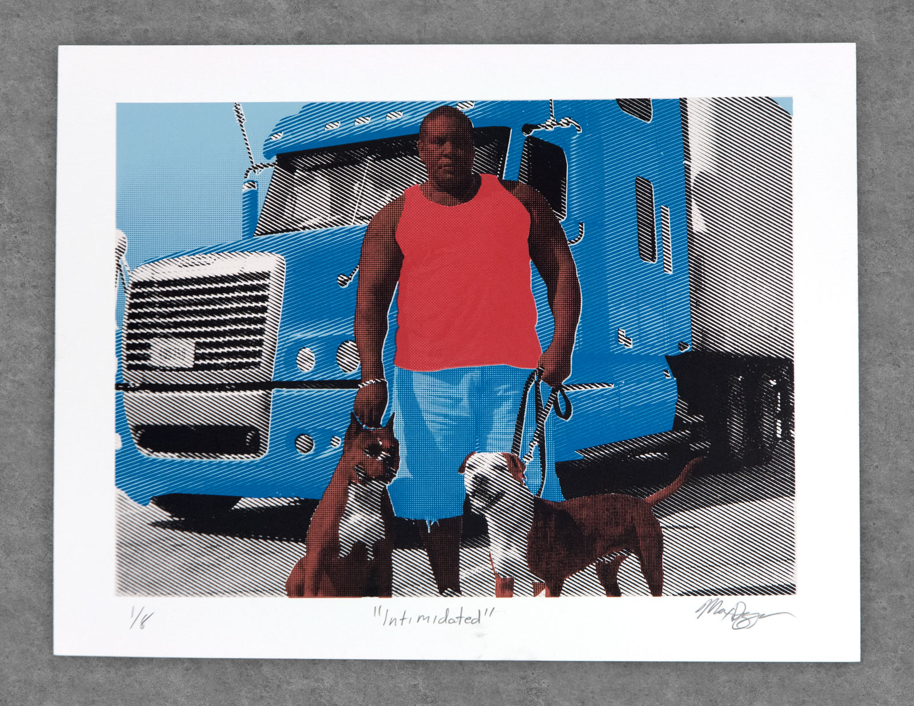

# **INTIMIDATED** SERIGRAPHY
This piece was brought about first and for most by my love for this shot. I met this man at a rest stop after asking his wife for an image with the truck. She absolutely refused but to my surprise dragged this wonderfully scary man and dogs out of the truck and forced them to participate. I was delighted by the irony in that sometimes the biggest scariest truckers and dogs are the sweetest. This was also my first real experiment with using halftones to replicate photography.

