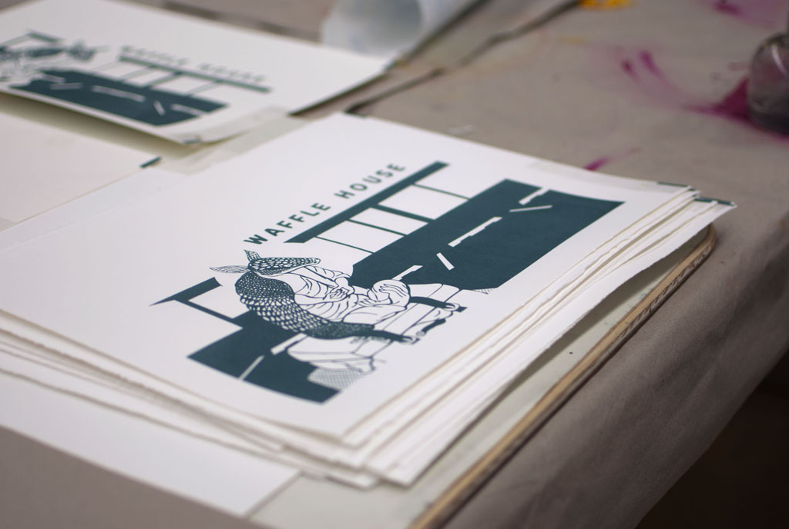
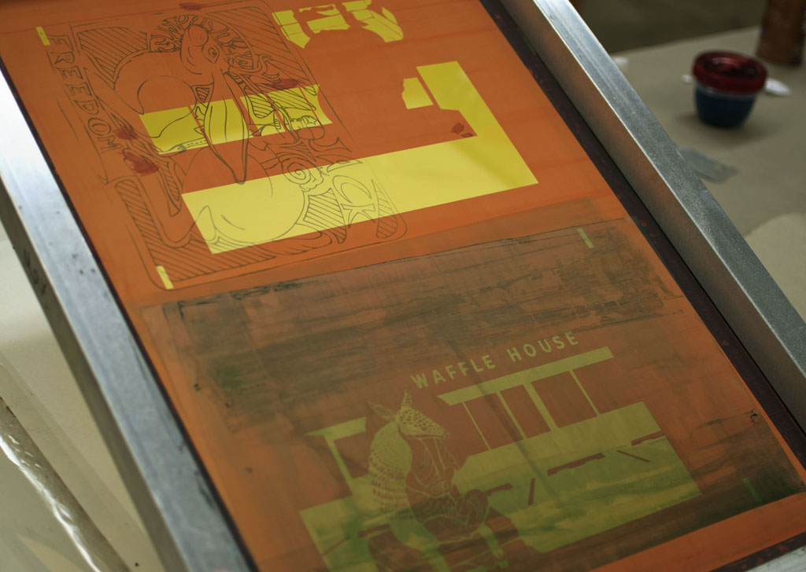
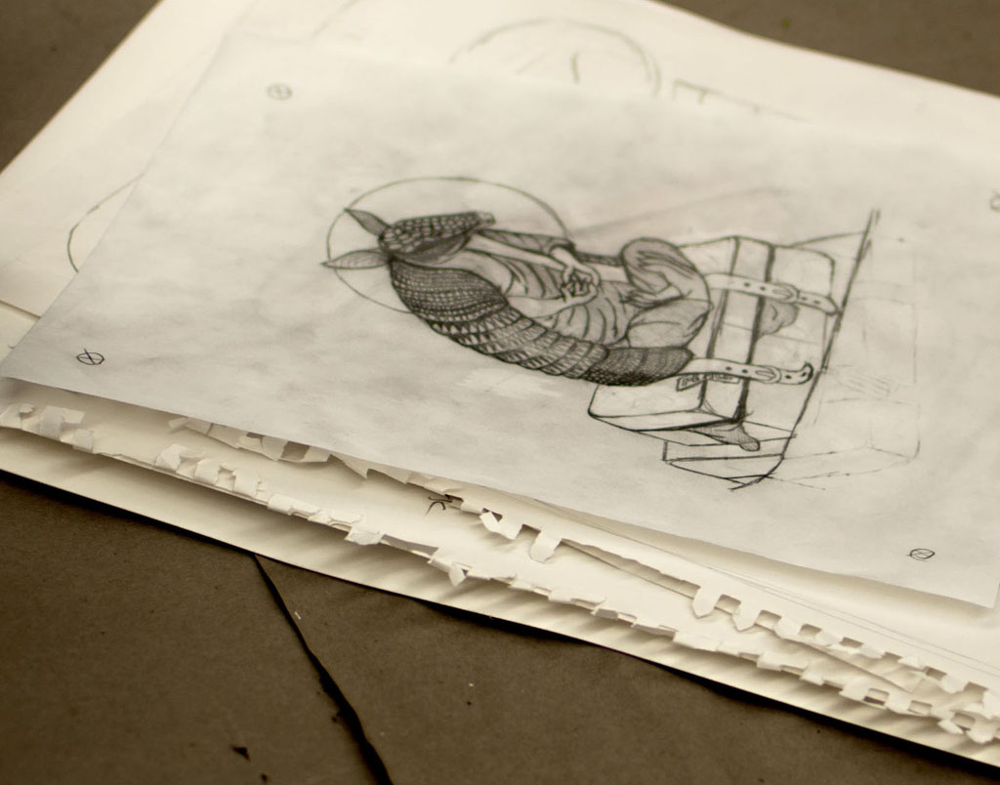

# **AT THE SIDE OF THE ROAD** Serigraphy
In this piece and the armadillo series as a whole, the armadillo represents men of the southern U.S. This specific rendition shows the hitchhiking bum, but in the robes of a monk to show the timid nature I have come to see in this lost demographic.

