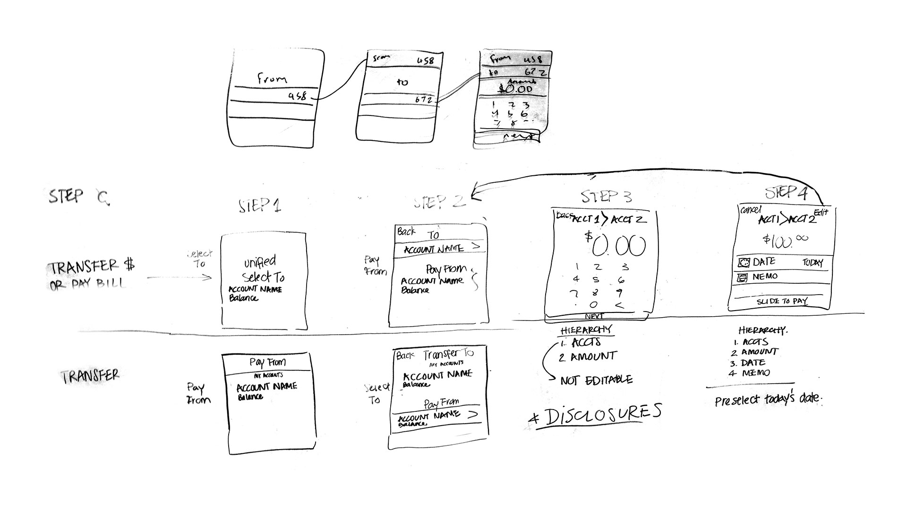
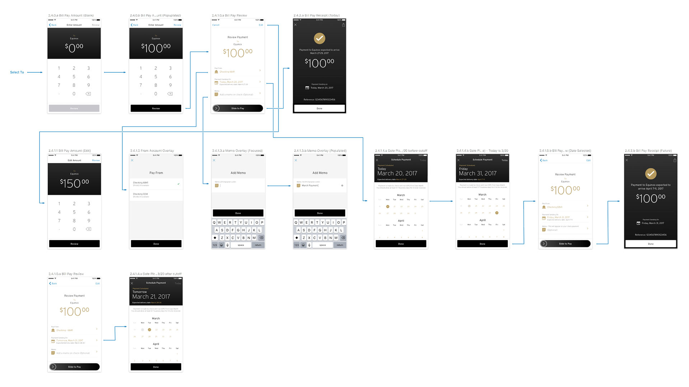
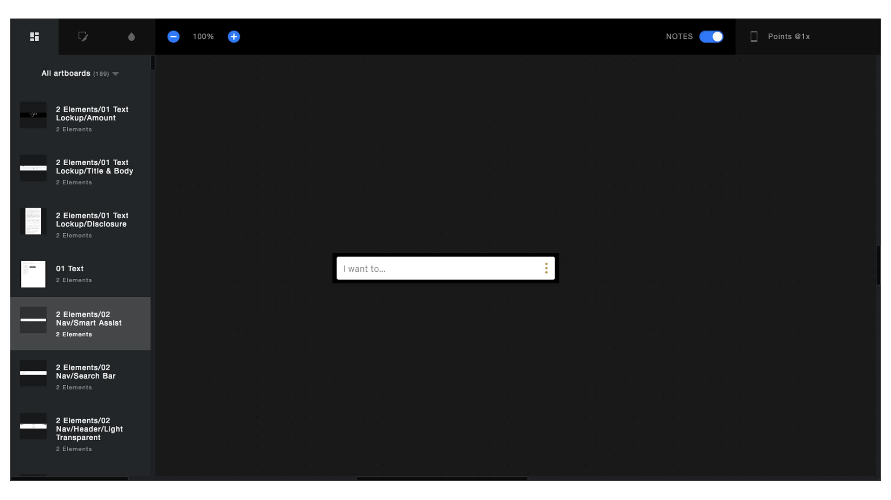
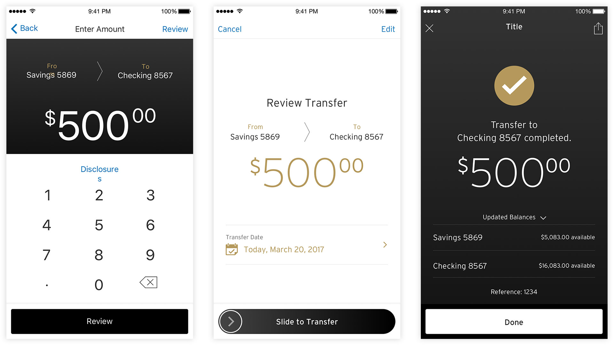
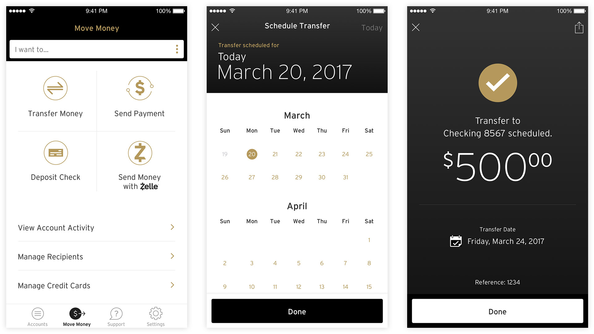

# **Citi** Mobile Banking
## **Company** | Fluid
## **Role** | Visual and UX Design
## **Type** | App Redesign
While working at the digital agency Fluid, we were brought in by Citi to help rev-invent their mobile app experience. We worked in-house across multiple work streams at the Citi building in Long Island City. I came into the project in the role of visual design for the money transfer workstream and filled the UX lead position after the departure existing lead. I worked closely with a team of consultants, developers, and Citi employees to guide the re-design from sketch, user flows, design review and through oversight approvals.

# **Project** Process
We worked in a fully agile environment a small nimble team consisting of a product owner, UX designer, Director, and me as the visual design, UX hybrid role. We worked in 2 week sprints to get designs to a remote engineering team. Focusing on sketching out flows and possible solutions quickly to work out issues quickly, the team had to keep the entire flow in mind. We innovated by taking using an automated program called Sketch Measure to save time on specifications.

<!-- 

 -->

# **Challenges** & Solutions
Our goal was to streamline the transfer of money for the customers, while keeping ourselves inside boundaries of banking laws and the existing Citi look and feel. We had to be creative to innovate within a pre-set design language, but found that by defining new interactions, we got the freedom to define a marginal look.

