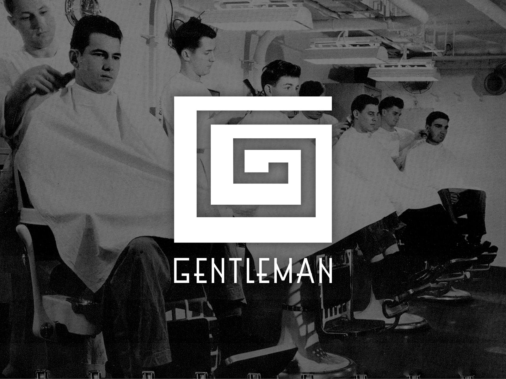
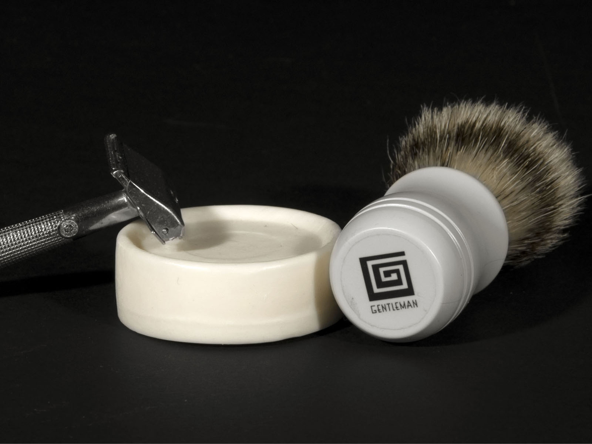
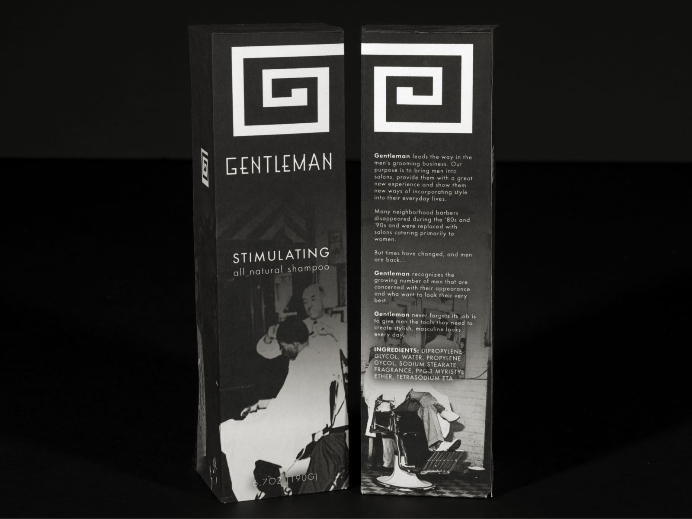
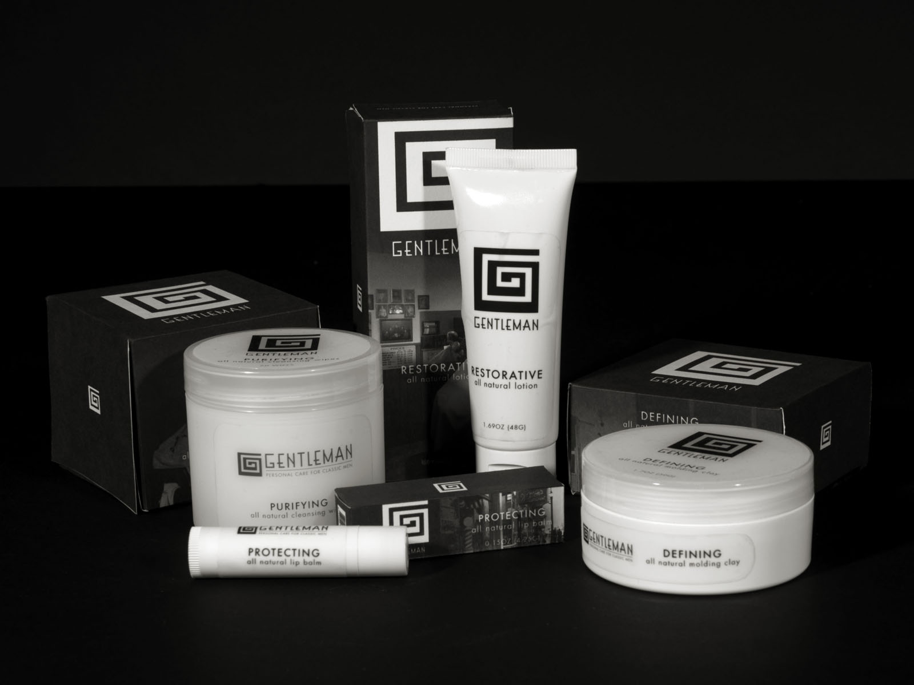
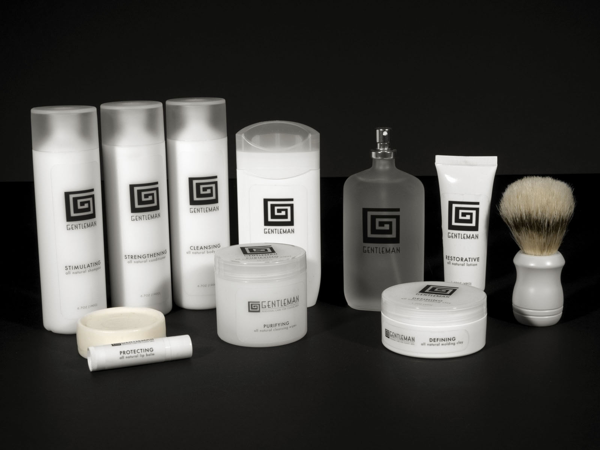

# **GENTLEMAN** MALE CARE PRODUCTS
## **Date** | 2013
## **Type** | Branding / Packaging
Gentleman is a conceptual line of male grooming products for the man who takes pride in his appearance.  I chose art deco as a style, with an emphasis on geometric elements. This led me to create a spiraling square mark, using alternating thickness to imply perspective. The challenge was to create packaging that jumped off the store shelves, but looked clean and simple on the bathroom counter.  The solution was high contrast, image heavy boxes for the store and minimalist black on white products for use at home.

