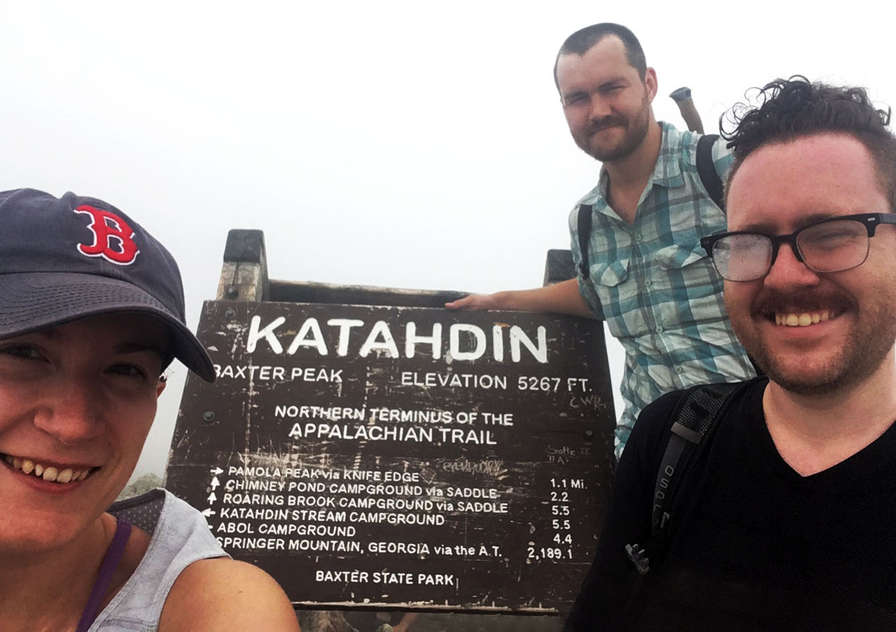

# **Appalachian Trail** 2018 Southbound
In 2018 I hiked the Appalachian Trail from Maine to Georgia in 112 days. This was the chance of a lifetime to spend a larger chunk of time experiencing the nature and people. I was humbled by the landscape I got to walk through everyday and the hikers and others along the way who helped me on my way. I started backpacking in 2016 and have found it to be a godsend for an introverted nature lover.
{: .half-text}
{: .half-tile}

# **Appalachian Trail** 2018 Southbound
In 2018 I hiked the Appalachian Trail from Maine to Georgia in 112 days. This was the chance of a lifetime to spend a larger chunk of time experiencing the nature and people. I was humbled by the landscape I got to walk through everyday and the hikers and others along the way who helped me on my way. I started backpacking in 2016 and have found it to be a godsend for an introverted nature lover.

# **The Start** Mount Katahdin
I started by summiting Mount Katahdin on July 2nd with my girlfriend Tember and best friend Matthew.

# **Hiking by the** Numbers
...

# **Gear, Gear &** More Gear
...

# **My Hiking** Partner
...

# **Halfway** Harpers Ferry
...

# **The End** Springer Mountain
...

<table>
  <tr>
    <th>Image</th>
    <th>Name</th>
    <th>Description</th>
    <th>Weight</th>
    <th>Quantity</th>
  </tr>
  <tr>
    <td>Sample text</td>
    <td><i class="fa fa-remove"></i></td>
    <td><i class="fa fa-check"></i></td>
  </tr>
  <tr>
    <td>Sample text</td>
    <td><i class="fa fa-check"></i></td>
    <td><i class="fa fa-check"></i></td>
  </tr>
</table>
