

# **La-Z-Boy** Re-Design
## **Company** | Fluid
## **Date** | September-October 2017
## **Role** | Lead
This project consisted of a site a refresh, with an emphasis on global navigation and fixing their product grid and product details page. We ran in-store research, talking with La-Z-Boy designers and developed a design system that would grow with the website.

# **Global** Navigation
For global navigation, I defined a set of sub modules that could be combined within a 5 column framework. This was important, since La-Z-Boy had plans for change in their product offering and wanted a navigation that could grow and adjust with the website.

<a class="max" rel="group" href="navigation-1.jpg" >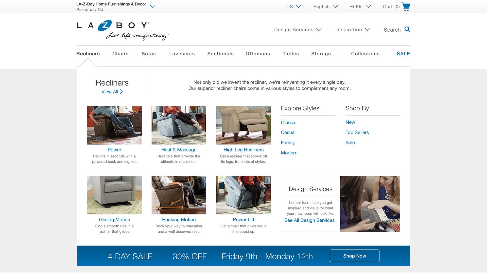</a>

<a class="max" rel="group" href="navigation-2.jpg" >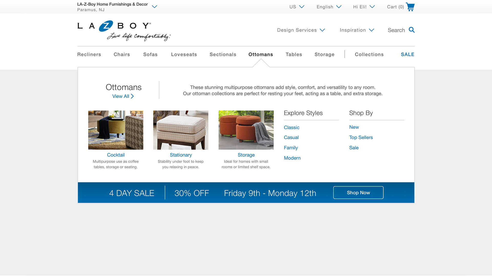</a>

<a class="max" rel="group" href="navigation-3.jpg" >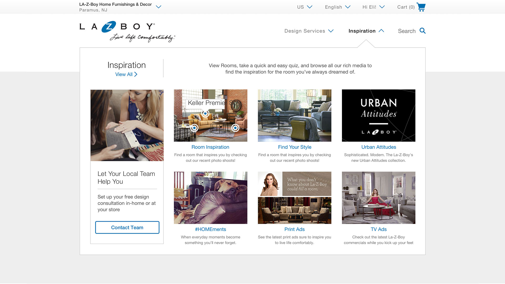</a>

<a class="max" rel="group" href="navigation-4.jpg" >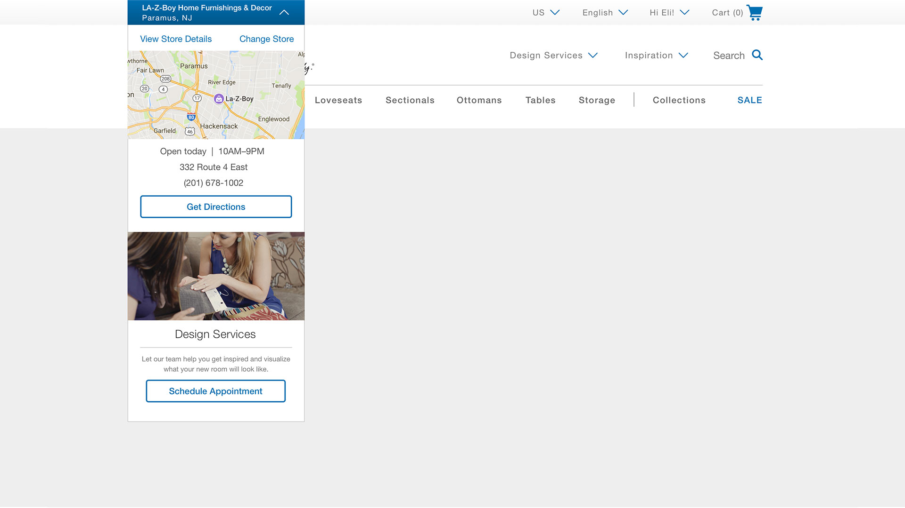</a>

# **Product** Grid
Utilizing a top filter and sort bar, allowed for larger more engaging product images in the grid. We used content tiles within the grid to emphasize the value propositions unique to La-Z-Boy and give the user that little extra push in the flow towards purchase.

<a class="max" rel="group" href="product-grid-1.jpg" >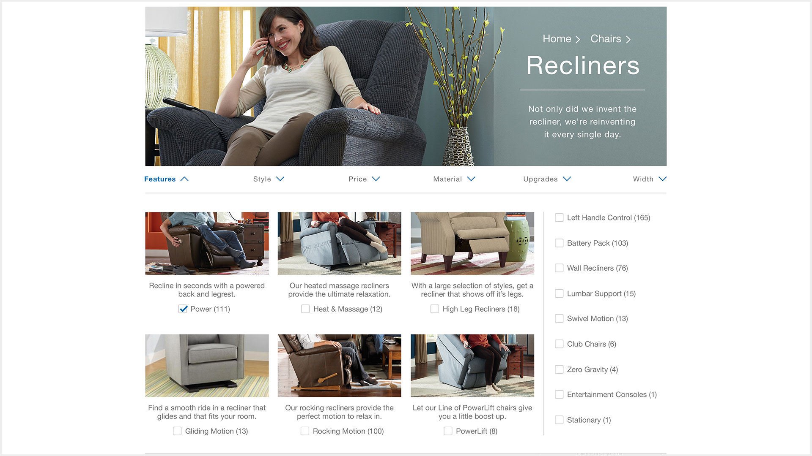</a>

<a class="max" rel="group" href="product-grid-2.jpg" >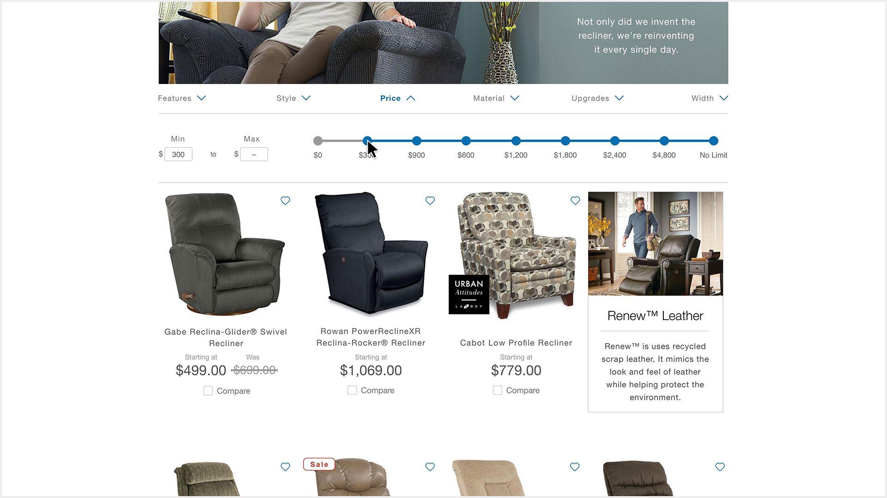</a>

<a class="max" rel="group" href="product-grid-3.jpg" >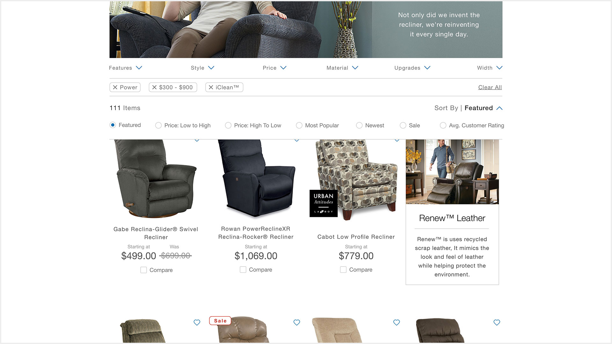</a>

<a class="max" rel="group" href="product-grid-4.jpg" >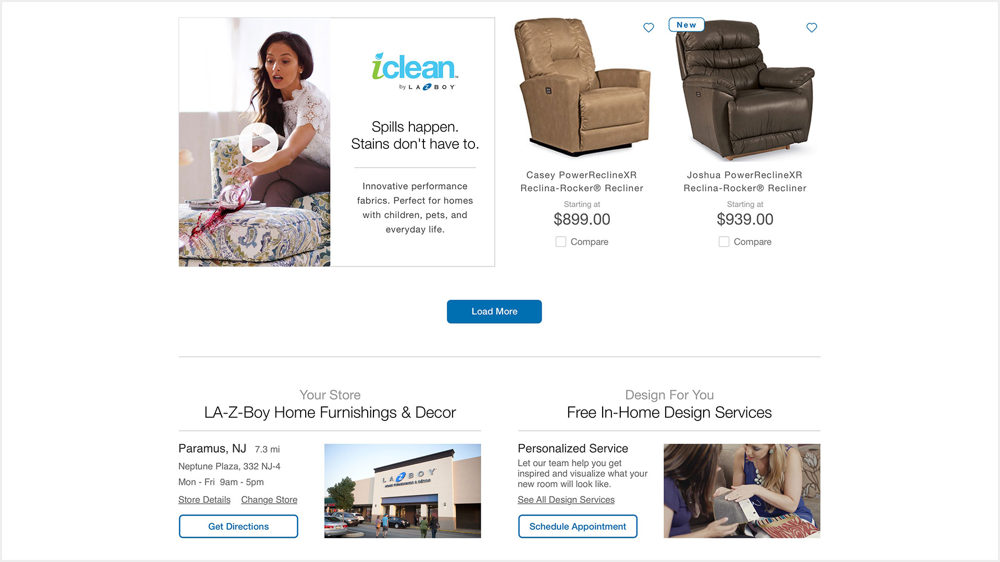</a>

# **Product** Details
With a mind boggling amount of SKUs, we designed an accordion based customizer to allow fabric selection and convey price adjustments. We used hovers to show adjusted price based on new fabric selections within general price range categories. We utilized tabs for supplemental product information.

<a class="max" rel="group" href="pdp-1.jpg" >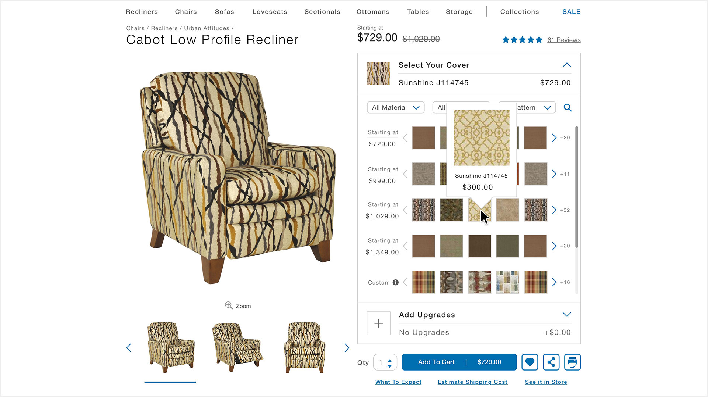</a>

<a class="max" rel="group" href="pdp-2.jpg" >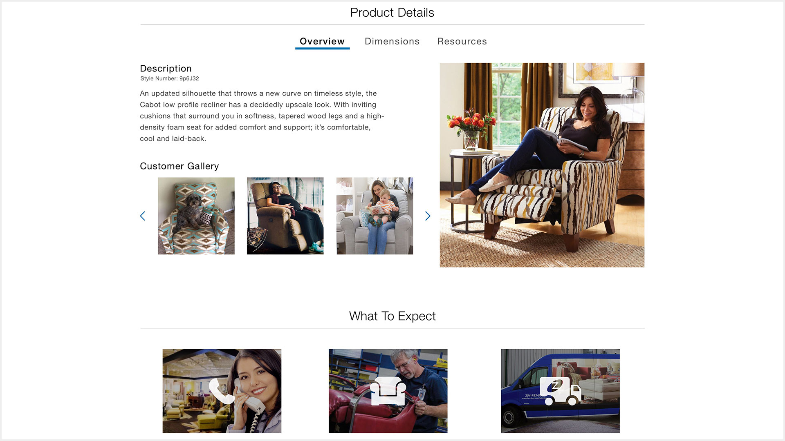</a>

<a class="max" rel="group" href="pdp-3.jpg" >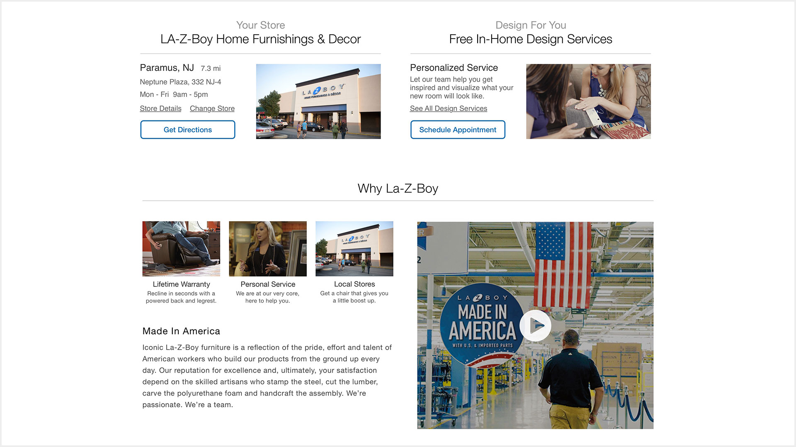</a>

<a class="max" rel="group" href="pdp-4.jpg" >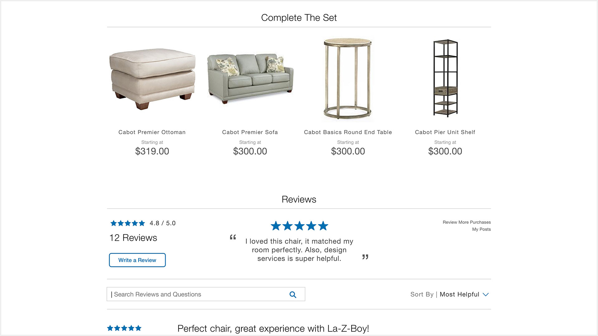</a>

# **supplemental** Content
Below the product information, we added a section on what the customer should to expect, since the process after an order was different from a traditional e-commerce transaction. La-Z-Boy has a higher price point than their major competitors, so we incorporated a section about their quality and manufacturing.

