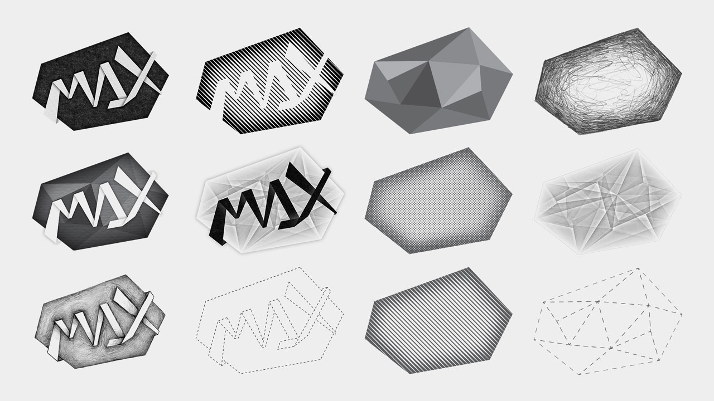
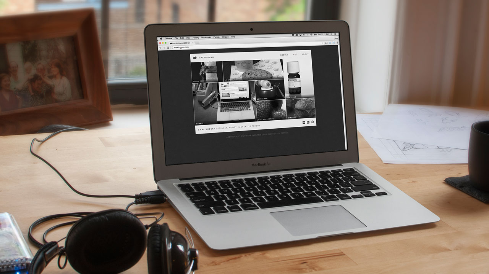
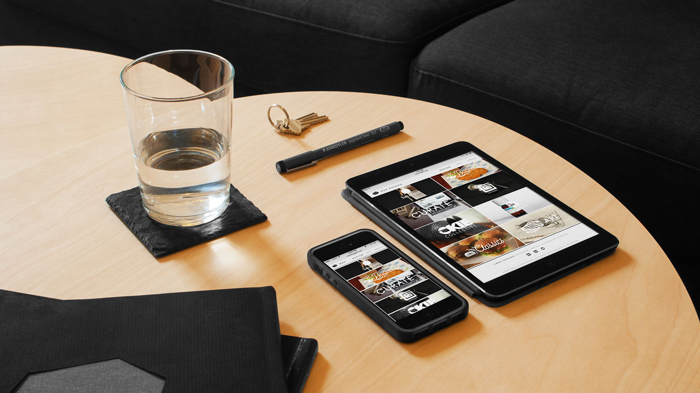
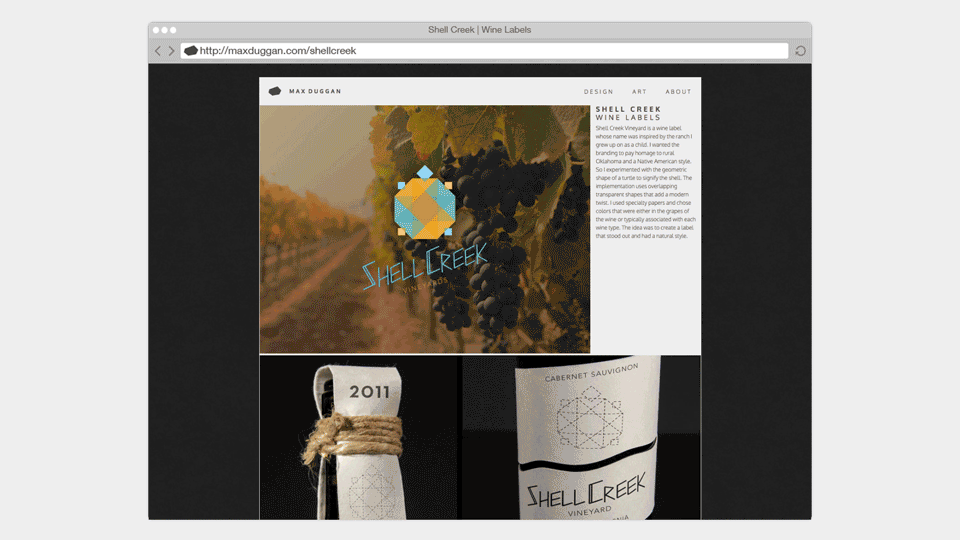
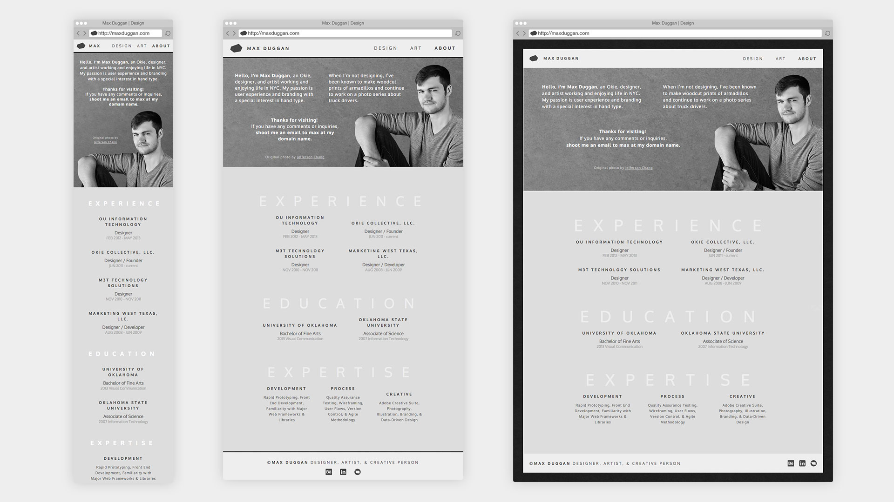
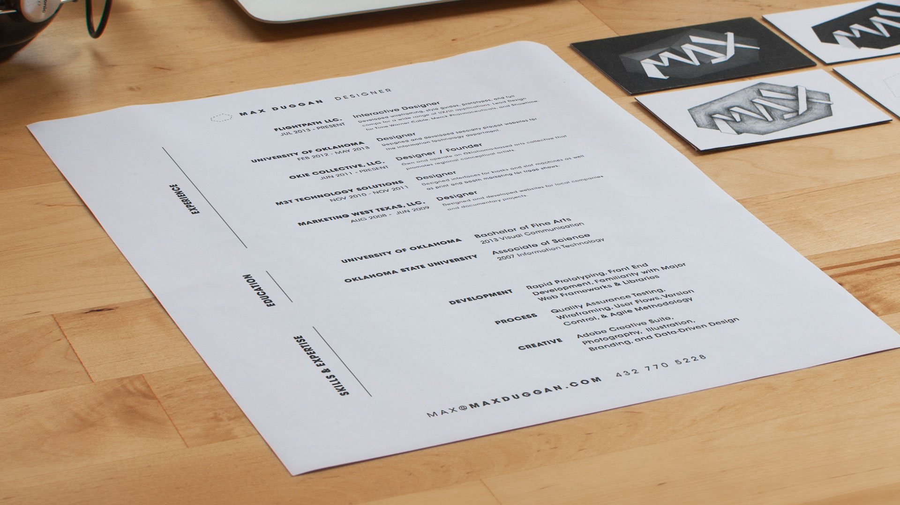
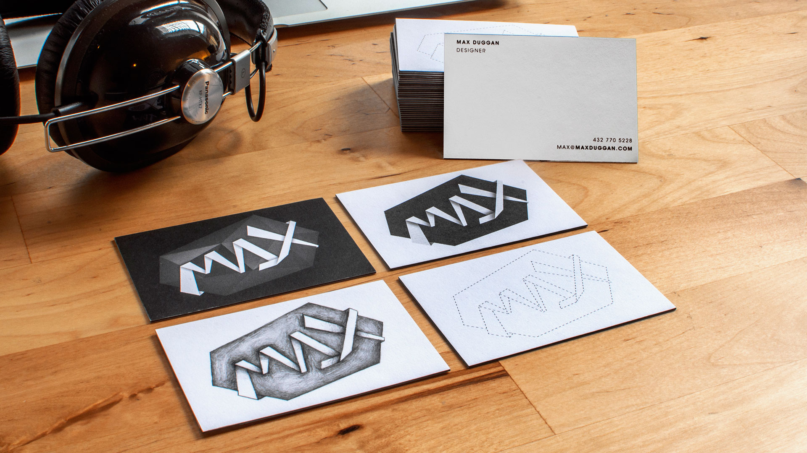
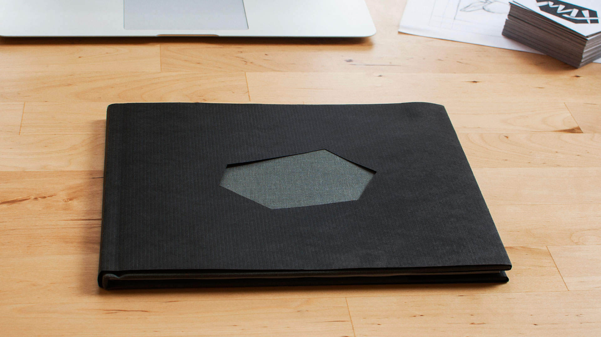
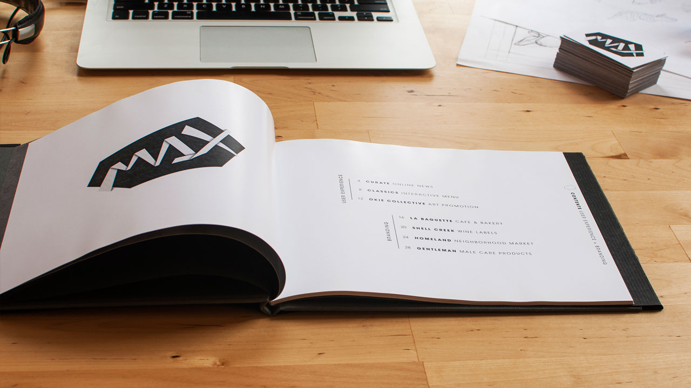
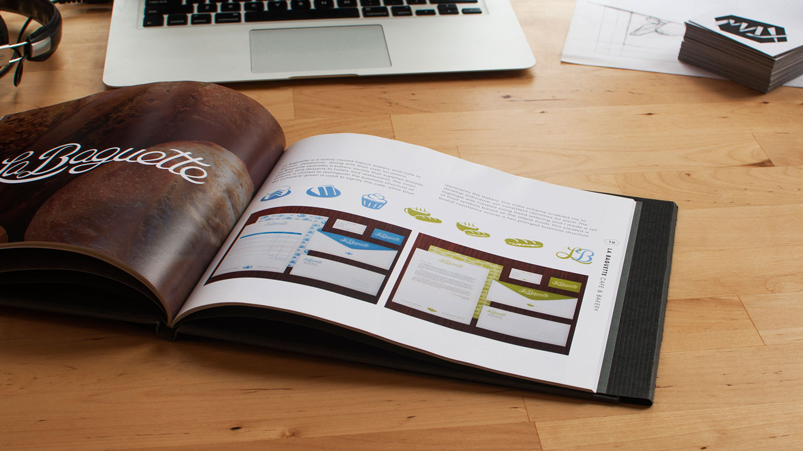

# **Max Duggan** Portfolio
My personal branding uses a black & White color scheme, this was an intuitive choice, it allows the work to show it's true colors and provided differentiation from most portfolios I've seen. The logo started with concept of making my name out of a continuous folded line. This wordmark then defined the shape of the logo by pulling out the angles of the line.

# **UX/UI**  
The first version of the site was an experimental grid system of 2px gutters with a series of enclosing boxes to achieve the abstract grid. This allowed me to greatly vary size of thumbnails and emphasize specific project. When upgrading the site to responsive, I kept the 2px abstract grid for desktop and worked backwards via two break points down to mobile. The site has a seperate touch version without hovers and other pointer based interactions. I used SVGs and CSS3 techniques that replaced sprites and large file sizes. Note the use of the logo as a unifing element in the lightbox navigation and custom back-to-top icon.

# **Print**
The print material features excesive white space and vertical type. The resume keeps a gutter that runs through the entire page and ties the content formatting to the title and footer. I experimented with the backs of the business cards to provide multiple variations of the logo. The portfolio book was bound in grey cloth and with a die cut the logo out of the center. The pages use the logo as a layout container to highligh text and page numbers.

