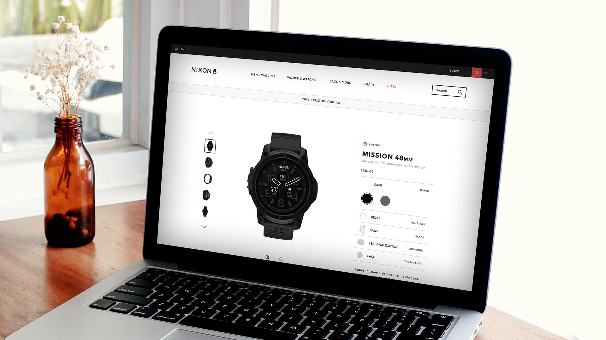
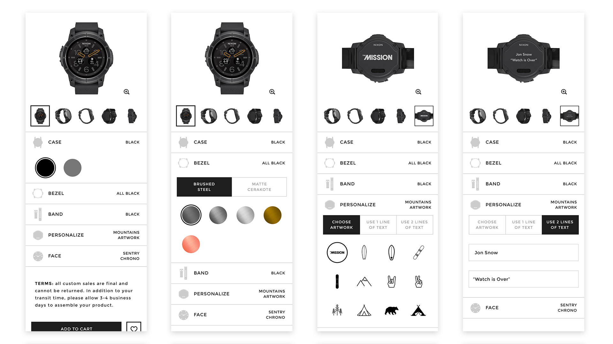

# **Nixon** Personalization   
## **Company |** Fluid
## **Date |** June 2016  
After a a successful site redesign, Nixon wanted to use Fluid's Configure customization platform for the the release of their first Androidwear smart watch - The Mission. I was brought in to lead Nixon through the process of selecting which base features were needed and how to structure them to create the most intuitive experience.

# **Complex** Challenges
There are lots of customization tools popping up, but I found the they take the user on complex journeys that require prior knowledge of that specific tool. I strove to make our system as uncomplicated as possible, within the technical framework of the Configure system and keeping the overall look and structure feeling like a part of the Nixon product page family.

# **Unique** Solutions
In the end, I believe we achieved a huge success in Nixon not just launching a smart watch, but a custom PDP that was simple and intuitive for the user. For the main menu of the interface, we went with a standard accordion design. In order to increase options, we had to add scrolling on desktop and extend options on mobile.  

