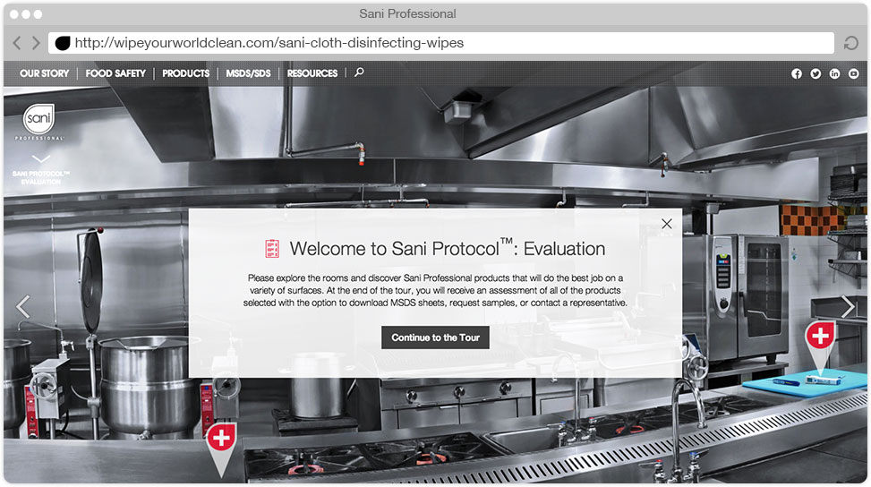
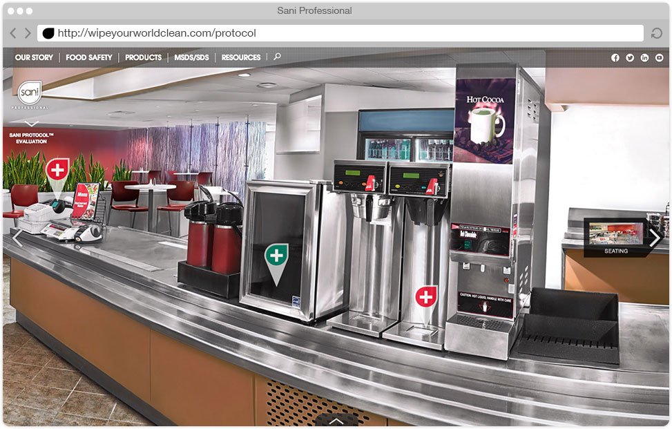
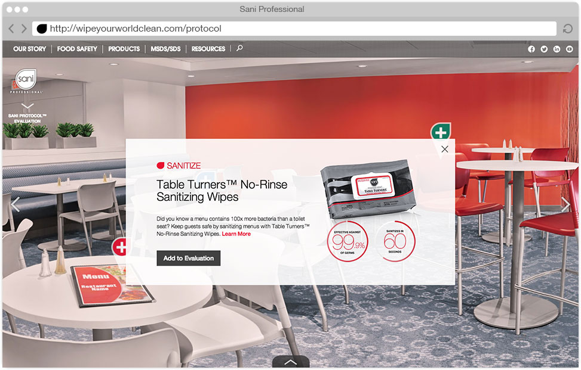
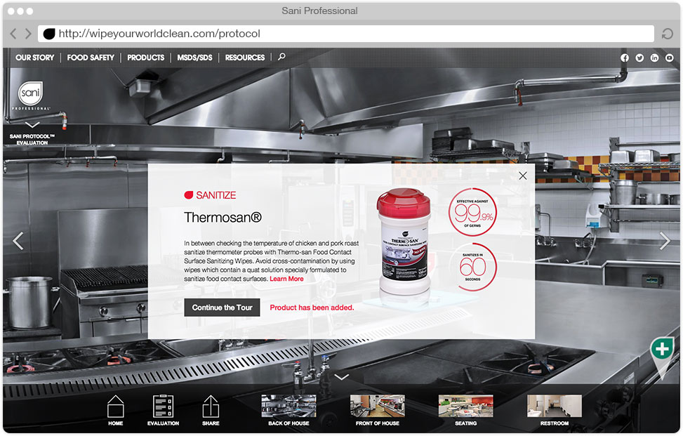
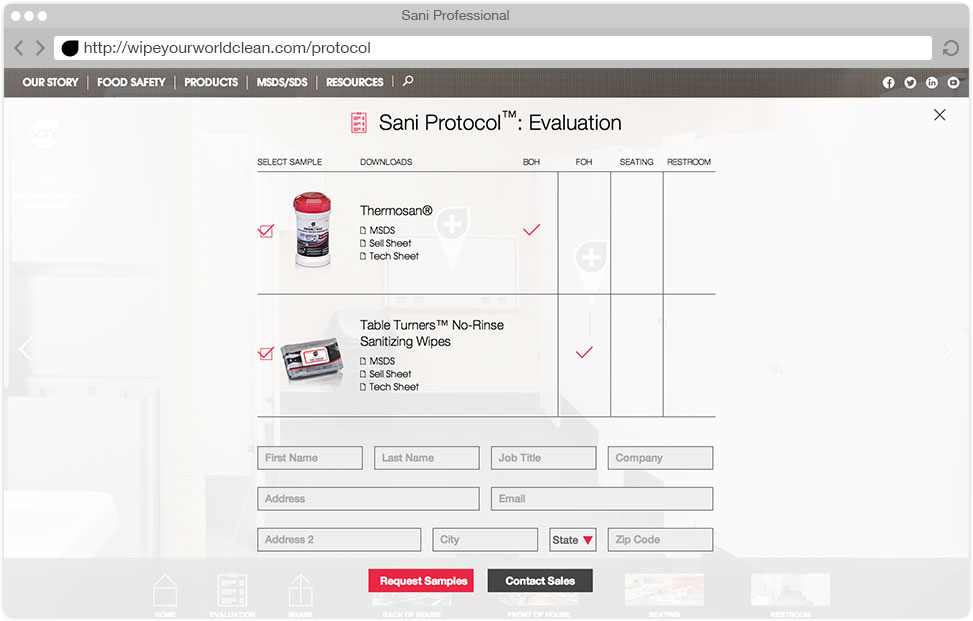

# **Sani** Virtual Product Tour
## **Company** | Flightpath
## **Role** | Visual Design and Technology Research
I worked on Sani Professional while at Flightpath. Sani Professional provides sanitizing wipes, and other cleaning solutions for the restaurant and food service industry. They challenged us to create a way for customers to better understand all of the uses for their products. Our solution was to create a virtual tour of a restaurant - from the kitchen, through the main area, even into the bathroom.

I was able to work with the developers to utilize {tool} and not only create a panoramic experience for each space, but allow the user to navigate from each space to the next.Within each of these spaces, my goal was to modify the photography to eliminate distraction. I designed a  set of

