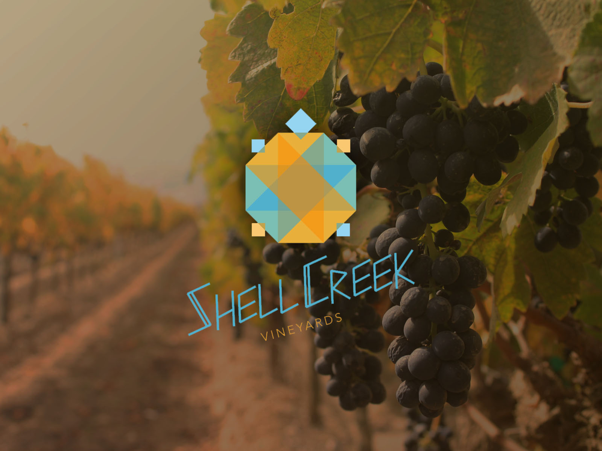
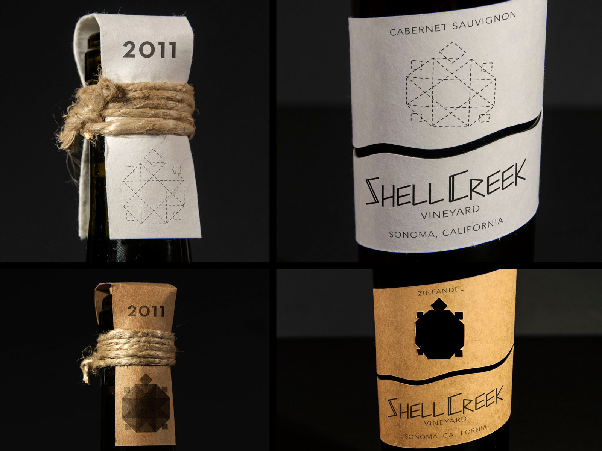
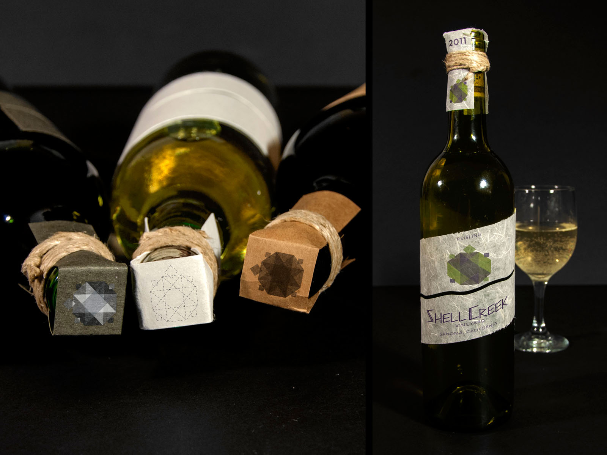
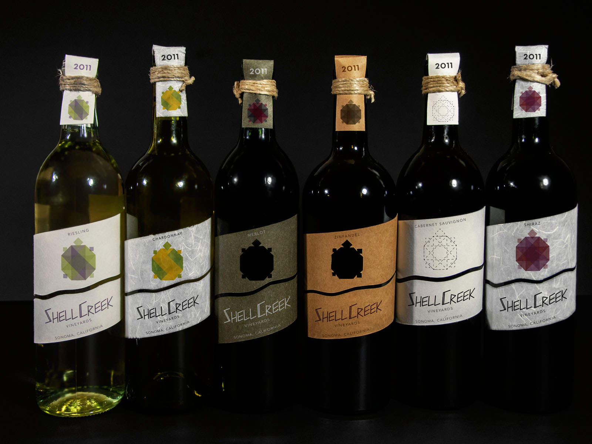

# **SHELL CREEK** WINE LABELS
## **Date** | 2013
## **Type** | Branding / Packaging
Shell Creek Vineyard is a wine label whose name was inspired by the ranch I grew up on as a child. I wanted the branding to pay homage to rural Oklahoma and a Native American style. So I experimented with the geometric shape of a turtle to signify the shell. The implementation uses overlapping transparent shapes that add a modern twist. I used specialty papers and chose colors that were either in the grapes of the wine or typically associated with each wine type. The idea was to create a label that stood out and had a natural style.

