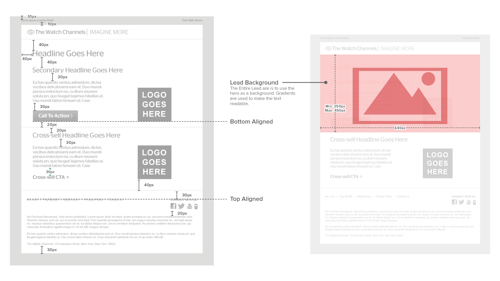
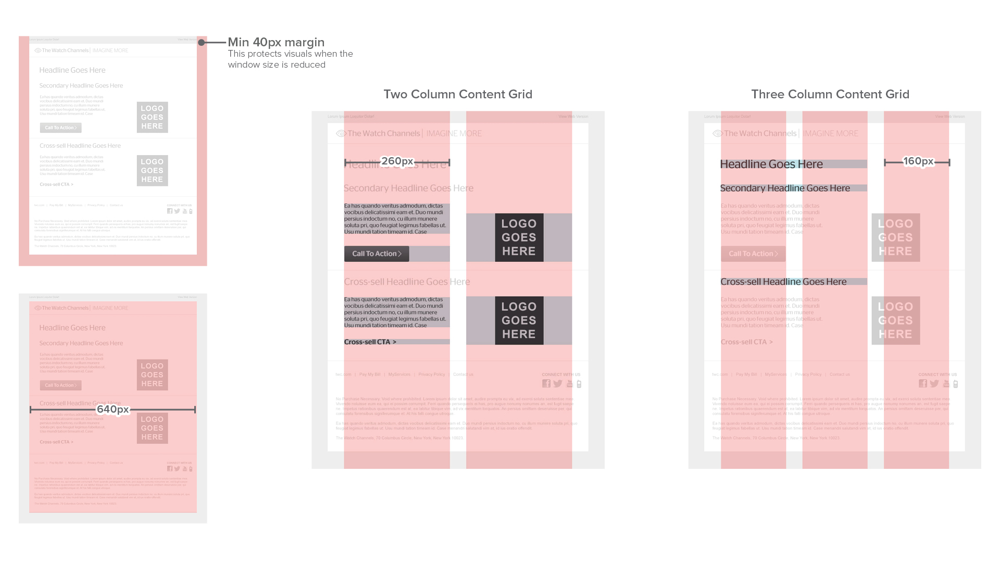
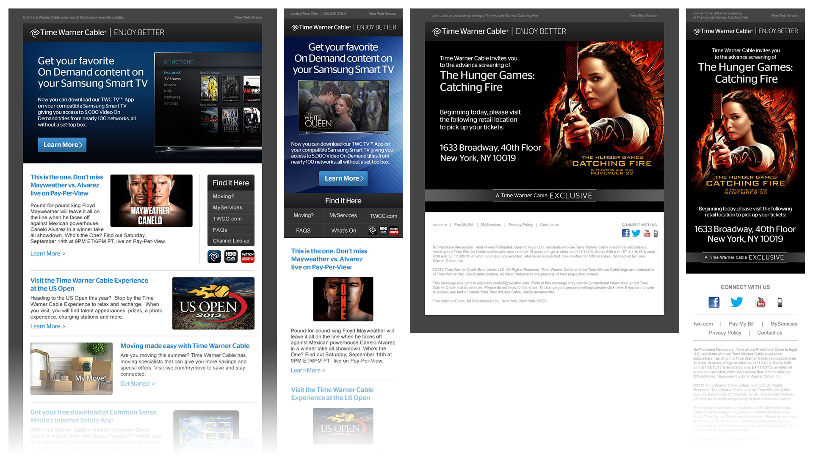
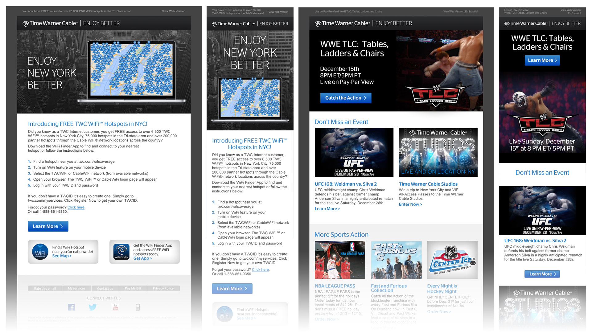

# **Time Warner Cable** UI/UX
## **Company** | Flightpath
## **Date** |  2013 - 2015
For this Time Warner Cable, I was tasked with leading a redesign of their entire email system. The company sends millions of emails every day to its customers and they very from account updates to advertising for premium channels. I developed a grid that would be adaptive to mobile and desktop.

# **Layout** Variation
Over the course of the project, we made hundreds of emails for various purposes. We made our system work with set elements and kept the layout variable to keep providing interest.

# **Email** Animation
For special events like WWE matches, we even used animation to spice up the emails. The challenge was keeping to our high standards of keeping the download speeds fast.

