

# **United Wholesale Mortgage** Adaptive Dashboard
## **Fluid** | Summer - Fall 2017
## **Role** | Project Lead - Senior User Experience Designer
United Wholesale Mortgage is the largest Mortgage loan provider. They work closely with Loan Officers and forgo selling directly to the end borrowers. Fluid was contracted to help them engage their core audience of Loan Officers in a way that made their site a one-stop-shop when choosing where to take the end customers business. We dealt with their marketing and Engineering teams, using an agile approach. Our concept was to take a set of tools unique to UWM, used by their active customers, and bring some of that power and usefulness to their public homepage.

# **Initial** Research
After initial stakeholder interviews, we ran a content analysis on the site and showed the client the main content problem of bifurcation - that their marketing and tools were overly separated. By combining the two, we could make a more intuitive platform for users.

<a class="max" rel="group" href="uwm-content-audit.jpg"  title="• I began analyzing the content of their existing site to understand what type of content we had, which users could see it, and what purposes it served.">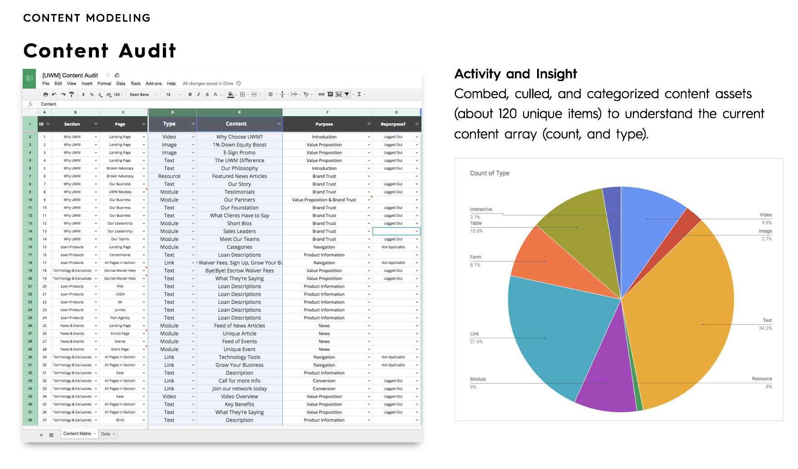</a>

<a class="max" rel="group" href="uwm-analysis.jpg" title="• I distilled the content model into sections and graphed where they lived. • Users were blocked from content because it was bifurcated between the public facing and logged-in sides of the site.">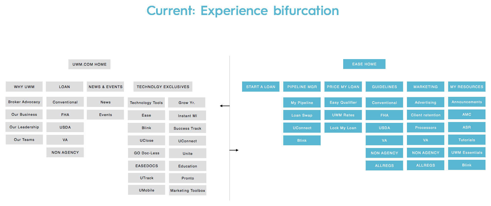</a>

# **analysis and concept for content types**
From our initial research, we showed some of our analysis and an overarching content model. We identified main content types and proposed a zone structure.

<a class="max" rel="group" href="uwm-content-model.jpg" title="I also took the content and broke it up by purpose. This modeling allowed us to zone our design by the various content uses.">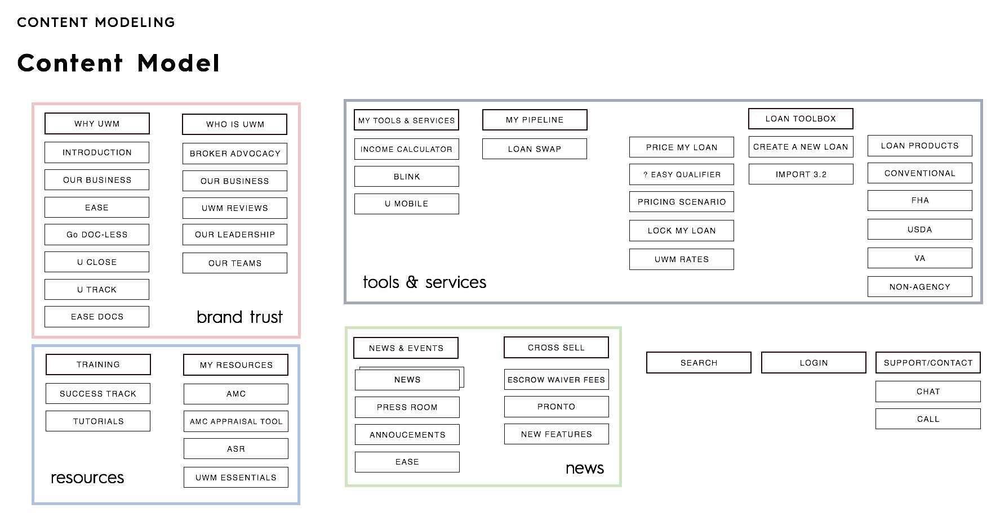</a>

<a class="max" rel="group" href="uwm-content-zones-initial.jpg" title="We took the model further by serving up content by mapping content's purpose to user type.">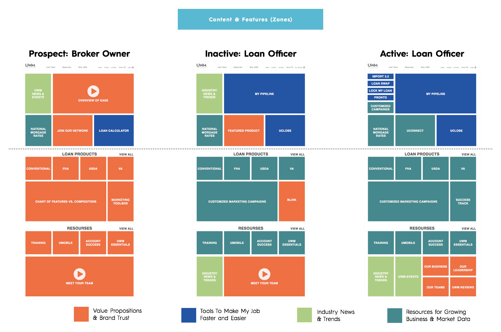</a>

# **ethnographies**
To understand our target audience, I ran ethnographic studies with a variety of loan officers in LA - their biggest market. These studies provided me the insight to find out what really would help a loan officer in their day-to-day business. We discovered the loyalty a good user experience could bring to their B2B relationships.

<a class="max" rel="group" href="uwm-ethnography-2.jpg" title="To understand our target audience, I ran ethnographic studies with a variety of loan officers in LA - their biggest market.">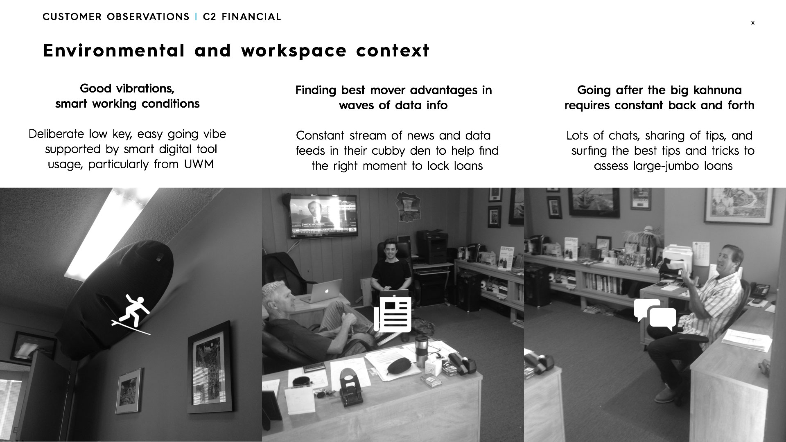</a>

<a class="max" rel="group" href="uwm-ethnography-3.jpg" title="These studies provided me the insight to find out what really would help a loan officer in their day-to-day business. We discovered the loyalty a good user experience could bring to their B2B relationships.">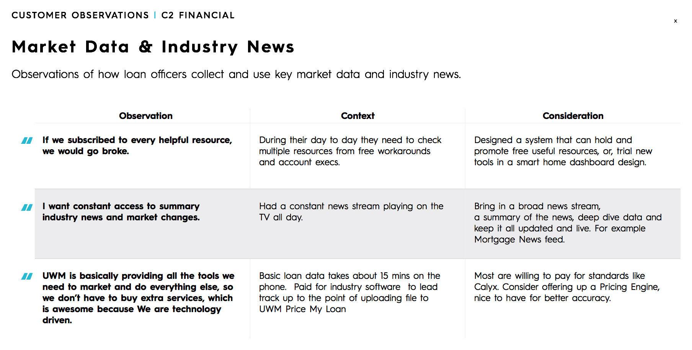</a>

# **User Journey**
A big part of the challenge was dealing with users at various states, for this, we made user journeys in addition to breaking the site architecture up by logged in, logged out, and cookied users.

<a class="max" rel="group" href="uwm-templates.jpg" title="Depending on the user's state, their journey through the pages would be adjusted.">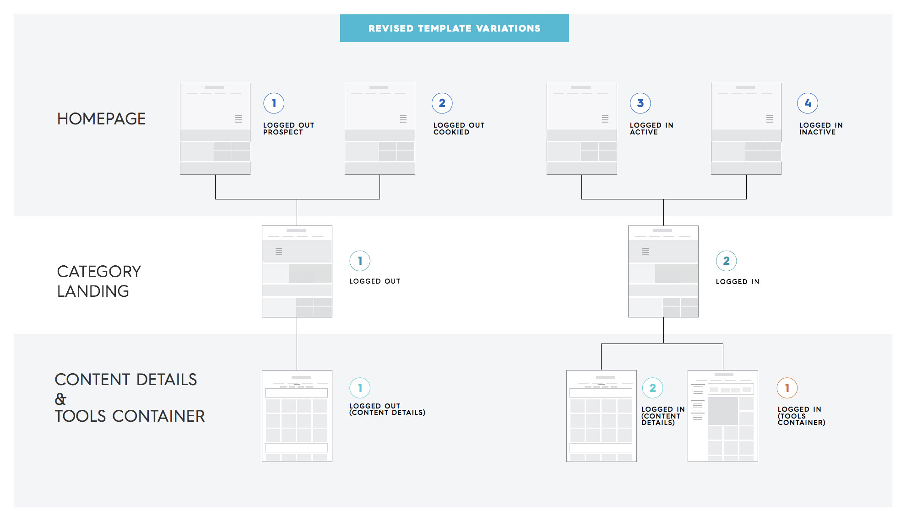</a>

<a class="max" rel="group" href="uwm-template-variations.jpg" >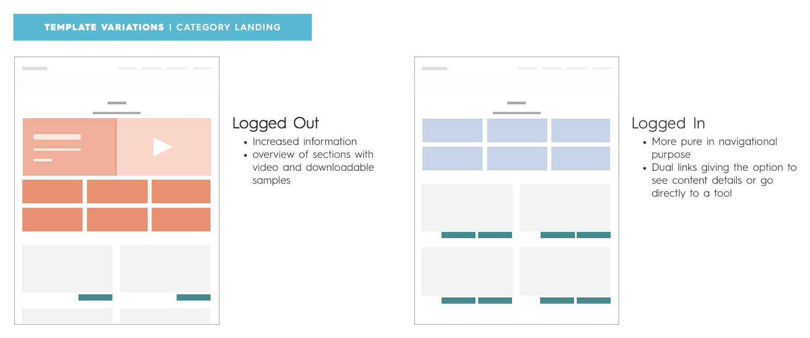</a>

# **Navigation**
Instead of using analytics strictly to develop our navigation modal, we humanized it by making our navigation match the day of a loan officer. Following up on major categories, we created a module system for the mega menus, so that the site could grow over time.

<a class="max" rel="group" href="uwm-proposed-architecture.jpg" title="By modifying our content model, I developed a site model to show the general navigation structure.">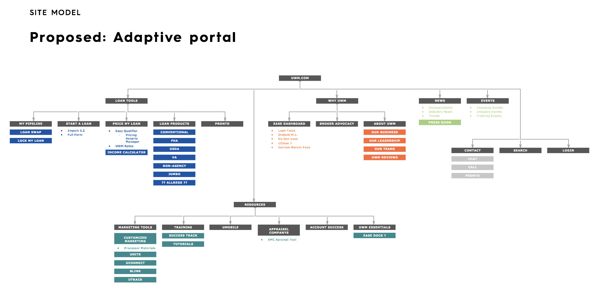</a>

<a class="max" rel="group" href="uwm-nav-wires.jpg" title="The site structure was then broken down so that we could match it to the primary and secondary levels of global navigation.">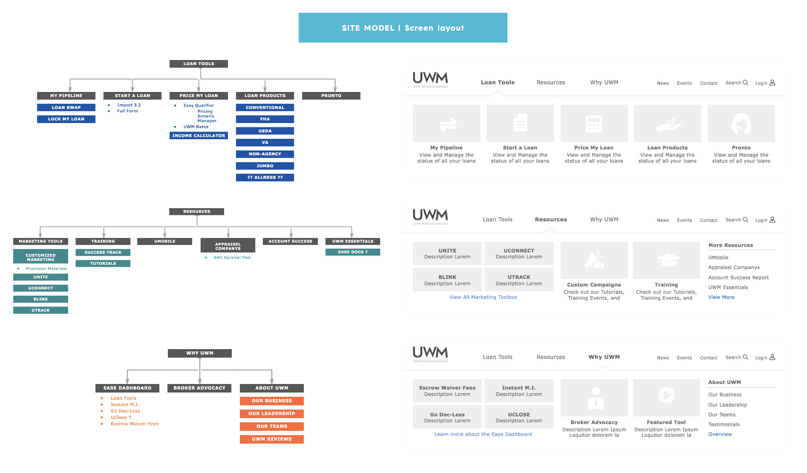</a>

<a class="max" rel="group" href="uwm-site-architecture.jpg" title="After identifying the broad structure of the navigation, the entire site was broken into a site architecture around the various user states from prospect to an active user.">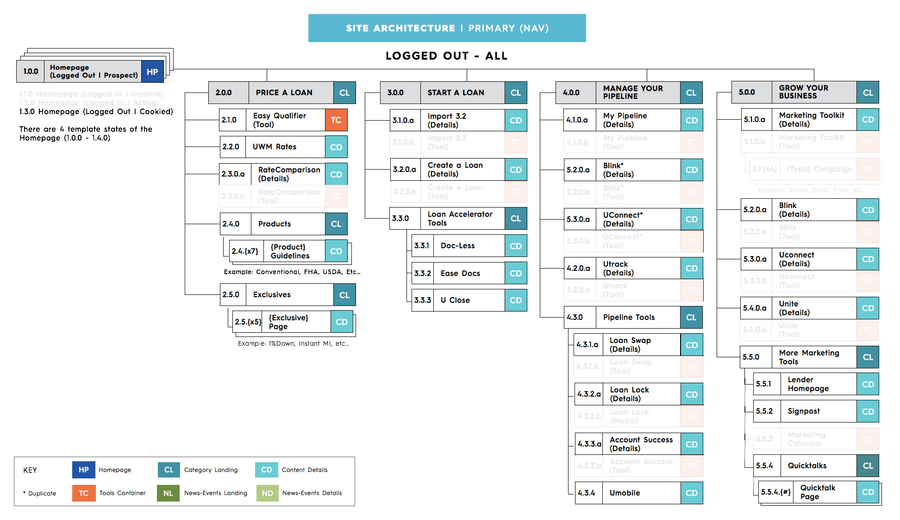</a>

# **From the whiteboard to Final Designs**
Because of the speed of this project and my history in visual design, we went in with a goal of high fidelity wireframes. We utilized sketches features, and from the smallest elements, I built the sketch file so that visual design could come in and replace generic styles, rather than building from scratch. I involved visual design as early in the process as possible, so that they could be in on the very first UI decisions.

<a class="max" rel="group" href="sketches-1.jpg" >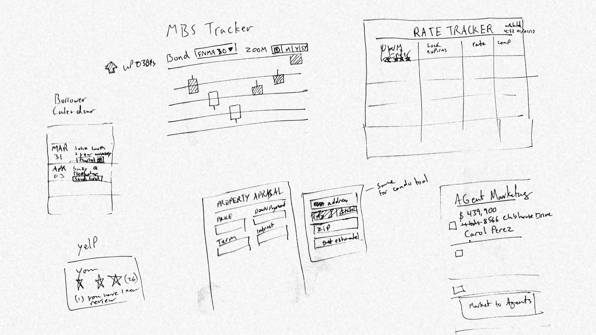</a>

<a class="max" rel="group" href="wires-1.jpg" >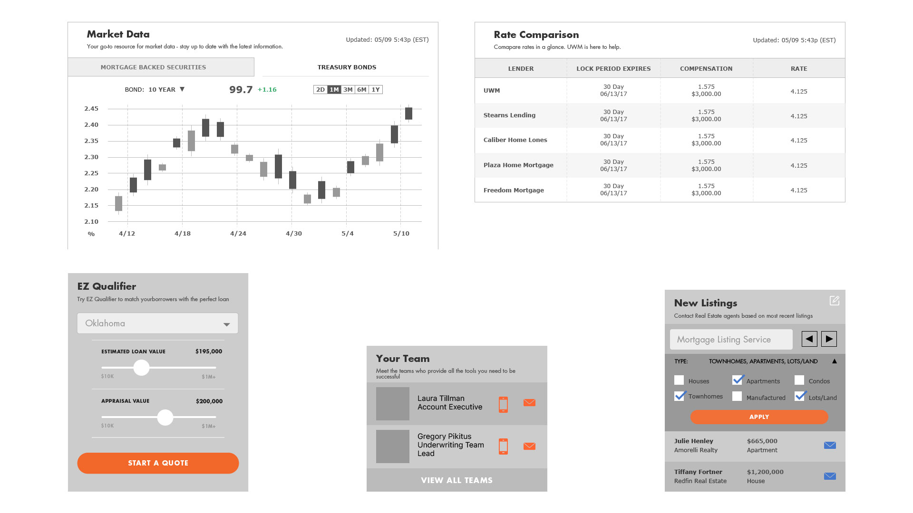</a>

<a class="max" rel="group" href="visuals-1.jpg" >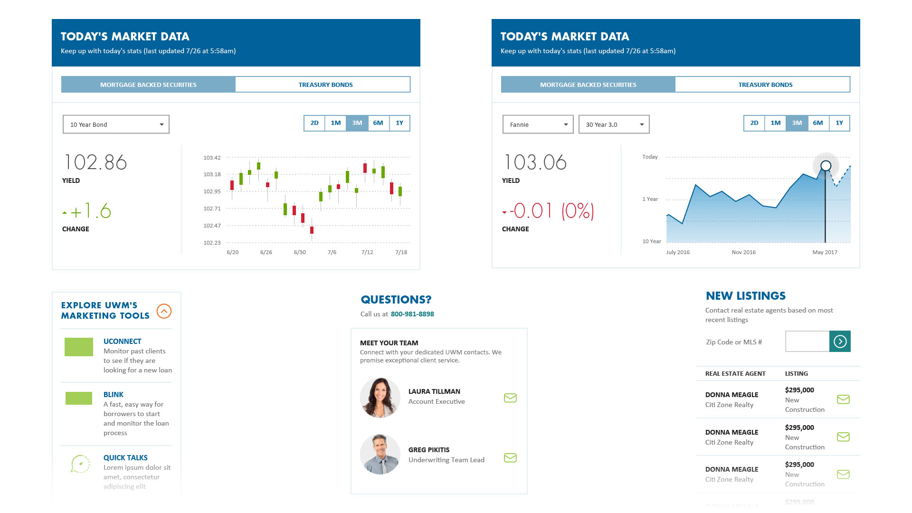</a>

<!--
<a class="max" rel="group" href="wires-visuals.jpg" >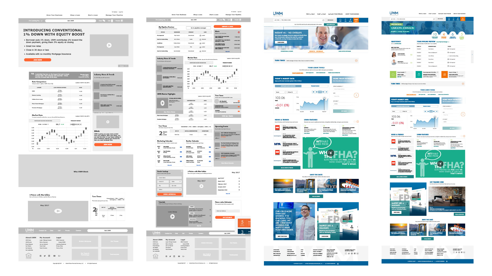</a>

<a class="max" rel="group" href="mobile-1.jpg" title="Because we worked with a simple grid system for the homepage, many modules were able to remain the same size from desktop through to mobile." >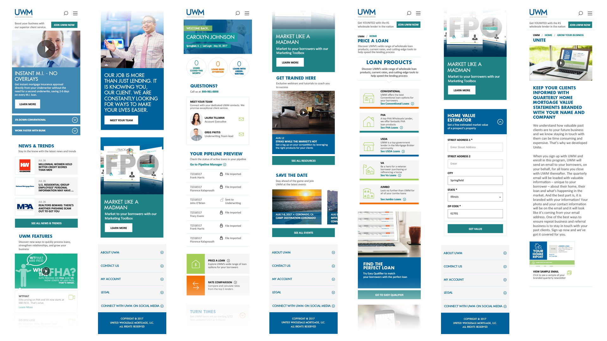</a>
-->

# **Keeping it all together**
We managed a high level of complexity by utilizing a single source of reference for the entire team.  Confluence was used as an ever-changing wiki for requirements gathering, functional specs, design, and assets. The documentation structure was based on the site architecture and secondary structure on the atomic design model for the UI. The payoff came during transfer from design to engineering. Engineers could quickly move between tickets in Jira back through epics and stories to Confluence, and find all the information they needed from design.

<a class="max" rel="group" href="uwm-atomic-design.jpg" >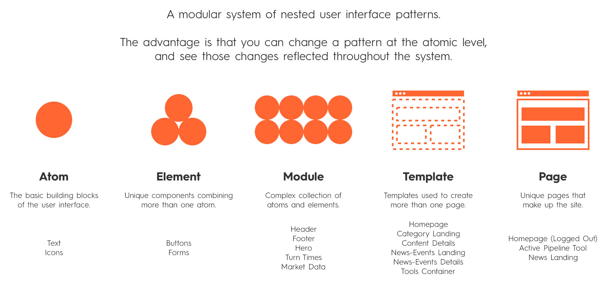</a>

<a class="max" rel="group" href="confluence.jpg" >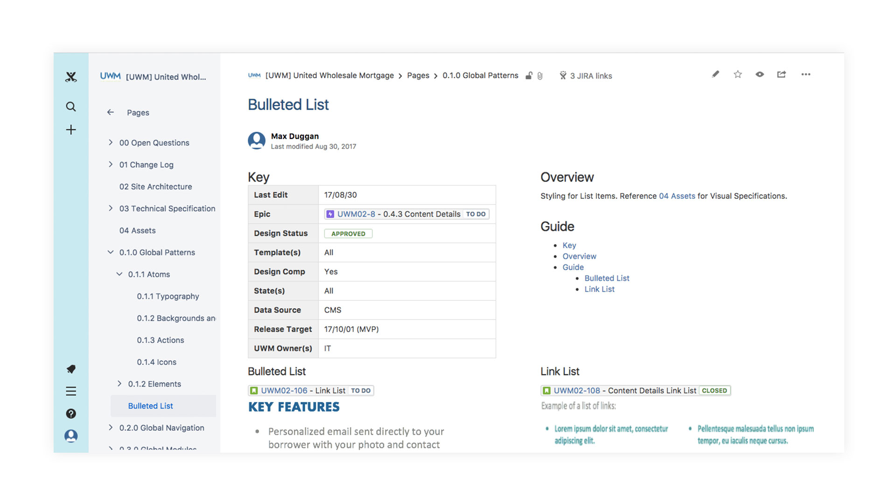</a>

## **Visual Design Credits** | Pam Tamayo

